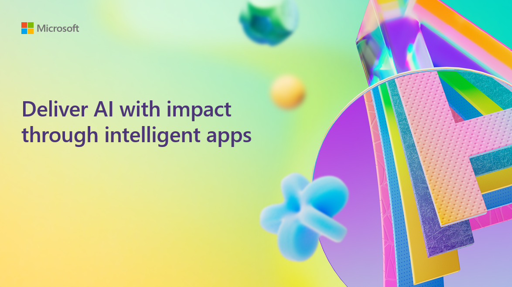

# BRK350: Delivering AI with impact through intelligent apps

## Session Description

Leaders from every industry are reinventing digital experiences, reshaping business processes and creating new products with generative AI. Explore use cases and the value your business can realize with intelligent apps built on Azure.

## Goals
- Convince customers that Azure is the best partner for intelligent app innovation
- Position intelligent apps as the new standard
- Establish key business objectives and ROI/outcomes
- Showcase real customer stories

## Key audience takeaways
- Intelligent, AI-powered and genAI-enabled apps are the new standard
- Customers can realize considerable ROI through strategic investments in building and modernizing intelligent apps
- Intelligent apps can drive significant, measurable impact in business processes, employee experience, product innovation, and customer experience
- Microsoft and our partner network can help!

## Session Resources
You can find additional resources, including the slides of the presentation here.

| Resources          | Links                             | Description        |
|:-------------------|:----------------------------------|:-------------------|
| BRK350 English PPT Presentation  | [Link](https://aka.ms/AArx9wb/) | Full presentation deck in US English |
| BRK350 Korean PPT Presentation  | [Link](https://aka.ms/AAv6jjg/)| Full presentation deck in Korean |
| BRK350 Japanese PPT Presentation  | [Link](https://aka.ms/AAv6jjf/)| Full presentation deck in Japanese |

## Content Owners
Nikisha Reyes-Grange, Director of Product Marketing, Microsoft

